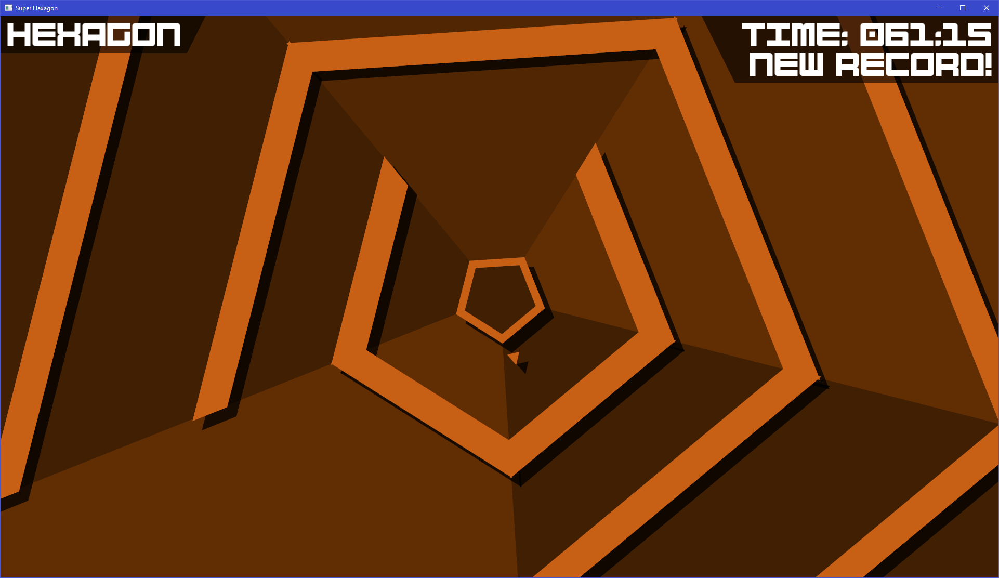
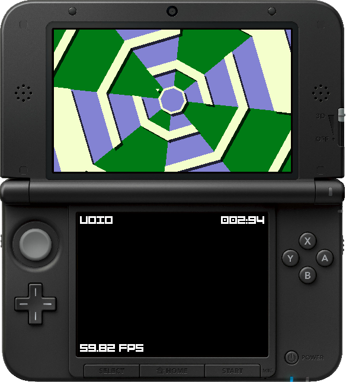

#  Super-Haxagon

Super Haxagon is an cross platform, open source [Super Hexagon](http://superhexagon.com/) clone for the 3DS, Windows, and Linux. It runs full speed on the old 3DS, new 3DS, and in [citra-emu/citra](https://github.com/citra-emu/citra). It also has a GUI based level editor called [Haxa Editor](https://github.com/RedInquisitive/Haxa-Editor).

## Download

You can download the latest build on [the releases page](https://github.com/RedInquisitive/Super-Haxagon/releases) to the right.

## Features

 * Cross Platform
 * Widescreen support
 * High Refresh Rate support
 * Custom Levels
 * OGG decoder for BGM
 * High Score Saving
 
## Credits
 * Audio from [Open Hexagon](http://vittorioromeo.info/projects.html)
 * ...And more audio by [Kevin MacLeod](http://incompetech.com/) under [Creative Commons: By Attribution 3.0](http://creativecommons.org/licenses/by/3.0/)
 * 2D engine by fincs at [devkitPro/citro2D](https://github.com/devkitPro/citro2d)
 * 3D engine by fincs at [devkitPro/citro3D](https://github.com/devkitPro/citro3d)
 * Smea for [the CTR User library](https://github.com/devkitPro/libctru)
 * Actual font: [Bump IT UP](http://fontstruct.com/fontstructions/show/155156/bump_it_up)
 * and all of the people on the [contributors page](https://github.com/RedInquisitive/Super-Haxagon/graphs/contributors) (seriously, thanks!)

## Building

Super Haxagon can build for 3DS and Windows (MinGW + MSVC). For desktop platforms, it uses a cross platform library called SFML, so it will probably also compile on Linux and MacOS without any issues.

### 3DS Build

1. Clone this repository with `git clone https://github.com/RedInquisitive/Super-Haxagon.git --recursive`
1. Get MinGW and DevkitPro
1. Use the provided Makefile with the command `make TARGET:=3DS`
1. Install either the CIA or 3DSX on your 3DS

### PC Build

1. Clone this repository
1. Download SFML and place it in the corresponding folder in `libraries`
1. Rename the SFML library folder to `SFML`

#### ... with MSVC

1. Use Visual Studio to open a folder with the CMake file
1. Build the game
1. Copy the `romfs` folder and `SFML/bin/openal32.dll` library next to the built executable
1. Press play

#### ... with MinGW

1. Get MinGW
1. Use the provided Makefile with the command `make TARGET:=WIN64` OR use the CMake file
1. Copy the `romfs` folder and `SFML/bin/openal32.dll` library next to the built executable
1. Launch the executable

## Screenshots

### Proof of Concept

